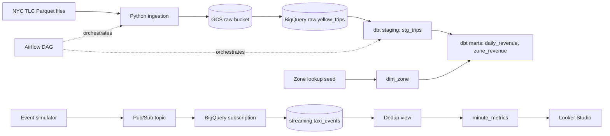

# Taxi Data Engineering Project (GCP)

End-to-end data pipeline on Google Cloud: batch ingestion, dbt transformations, Airflow orchestration, and real-time streaming.

## Architecture



## What's inside

| Folder | Purpose |
|---|---|
| `ingestion/` | Download, upload to GCS, idempotent load into BigQuery |
| `dbt/` | Staging and mart models, tests, zone dimension |
| `airflow/` | Docker Compose setup and the `taxi_monthly` DAG |
| `streaming/` | Pub/Sub event simulator |
| `scripts/` | Infrastructure setup commands |
| `tests/` | Unit tests (run in CI) |

## Key design decisions

- **Idempotent loads:** each month is staged, then replaced in one transaction, so reruns never duplicate rows.
- **Raw is immutable:** cleaning happens in dbt, never in the raw table.
- **Partitioned and clustered tables:** partitioned by pickup date to cut bytes scanned.
- **At-least-once streaming:** duplicates are removed in a view by `event_id`.
- **Data quality:** dbt tests for not-null, unique, and relationships.

## Run it

```bash
python -m venv .venv
.venv\Scripts\Activate.ps1
python -m pip install -r requirements.txt
gcloud auth application-default login
python ingestion/load_taxi.py 2024-01
cd dbt
python -m dbt.cli.main build --profiles-dir .
```

## Results

- 9.2 million Q1 2024 taxi trips loaded and modeled
- 91 days of daily revenue, zone-level revenue, and a live minute-level stream

## Tech

GCP (Cloud Storage, BigQuery, Pub/Sub), Python, dbt, Airflow, Docker, GitHub Actions
